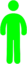
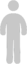
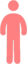
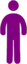

## Program 3 - Modeling Covid19 Part 2
#### Due: 05-11-2020 (Monday @ 5:00 p.m.)

## Overview

I've been on Discord almost every night at 7:00 p.m. for the last two weeks talking about Python and this project. There are also code examples available in a few locations based on our nightly discussions that include:

- This directory has: [Code_Examples](./Code_Examples/)
- The Resources directory has:
  - [10-PyGame](../../Resources/10-PyGame/)
  - [11-SIM](../../Resources/11_SIM)

The specifics of the project are very much based on the video by Grant Sanderson : [Simulating An Epidemic](https://www.youtube.com/watch?v=gxAaO2rsdIs&t=476s). He focuses on a population that is in one of the three possible stages of the SIR model (see below), and organizes subsets of the population into "communities" which could represent at a micro level: neighborhoods and at a macro level: countries. Basically, we start with a single or very very small portion of the population "infected" with some virus, and based on "infection rate" and (to name just a few) "social distancing", "travel" and possible common areas (where people congregate) we watch a visual representaion of a virus spread throughout a population.

### Modeling A Virus

Not every simulation uses the same "model" to represent an epidemic or in our case a pandemic. We are using the SIR model becuase it is straightforward and fits our purposes. It has three states:

**SIR model**:

- **Susceptible**:
  - This is the state that most everyone is in at the beginning of a simulation.
  - It means that the individual is "susceptible" to becoming infected with the virus we are modeling.
  - From susceptible, you can remain "susceptible" or go to "infected" and thats it.
- **Infected**:
  - This means an individual has contracted the virus.
  - It does NOT mean they are showning symptoms.
  - It also does NOT mean they are contagious!
  - From "infected" you can go to "recovered" and thats it.
  - In some simulations (not ours) you could go back to susceptible.
- **Recovered**:
  - This means an individual has been infected, and is now recovered.
  - They are NOT contagious.
  - They show no symptoms.
  - And in our simulation - they are **immune**. This is not always the case in real life, but for our sim it is.

Moving from one state to another is based on probabilities. The probabilities (variables that we should track) are listed below the colored images in the next section. The variables matter because they drive the simulation. Everything is based on a probability to some extent. For example, when two people come into contact, there is a "chance" you become infected (somewhere between 10-30 percent) unless you are "immune" in which there is a zero percent chance. Real life may have a very very small percent chance an immune person gets infected, but we are not getting that detailed. Another example would be that you have a %100 chance that you go from "infected" to "recovered". This is true because recovered could also mean "removed" (dead). But ... where is the probability in that transition? Well, the probability comes into play in determining how long someone is in the "infectious" stage. It can last from 2-14 days. There is also a probability involved in determining who shows "symptoms". Up to 25% of people with the virus never show symptoms! These are all things we must take into consideration when constructing our simulation.

**State Descriptions:**

| #    | State       | Description                                     | Exceptions                 |
| :--- | :---------- | :---------------------------------------------- | :------------------------- |
| 1    | Susceptible | Any person who can catch the disease            | Already infected or immune |
| 2    | Infectious  | A person that has the disease and is contagious | Quarantined                |
| 3    | Recovered   | A person who had the disesase and recovered     | Now Immune                 |

**Possible State Colors:**

| #    | State       | Color  | Image                                 |
| :--- | :---------- | :----- | :------------------------------------ |
| 1    | Susceptible | Yellow |  |
| 2    | Infectious  | Red    |     |
| 3    | Recovered   | Green  |   |

#### Other Colors

Use these colors for whatever. I just created the images and put them into the images folder in case you needed colors for any other reason.

|                White                 |                Gray                 |                Purple                 |                Orange                 |                Peach                 |                Dark Pink                 |                Light Blue                 |                Turquoise                 |
| :----------------------------------: | :---------------------------------: | :-----------------------------------: | :-----------------------------------: | :----------------------------------: | :--------------------------------------: | :---------------------------------------: | :--------------------------------------: |
|  |  |  |  |  |  |  |  |

### Simulation Values

These are the values you need to consider when modeling the simulation of a virus spread. You may use more, or split one of the values below into multiple values. As an example: "social distancing" is a variable that 1) is used to determine if we are social distancing (boolean) and 2) is also used to determine "how far" should we maintain social distance (integer). Its up to you and your implementation.

Example list of variables in no particular order ...

- **Day**
    - **Description:**
      - Some integer value that is equal to `N` iterations of the main python game loop
      - It should **not** be a `1-1` relationship with **Game Loop** since the game loop loops 30 to 60 times a second
    - **Possible Values:**
      - Integer value `1 - N` where `N = days` since start of simulation
- **Daily Interactions**
    - **Description:**
      - Number of interactions between people on average per day
      - Interactions gives opportunity for infected individuals to pass on disease
      - Passing on disease depends on: `Probability of Infection` see below
    - **Possible Values:**
      - Value between `0 - N`
      - `0` would be someone in quarantine or sheltered in place
      - Otherwise values between `3-5` or even up to `10-20` contacts depending on amount of travel
- **Game Loop**
    - **Description**
      - Directly related to the **Day** variable above
      - See info about **Day** above
- **Infection Radius**
    - **Description:**
      - Distance for a collision (aka contact) to possibly infect someone
      - Infection depends on probability of infection
      - Distance is measureed in pixels
    - **Possible Values:**
      - Possible values are 5-30 pixels
- **Initial Infected**
    - **Description:**
      - Number of individuals that start a simulation as infected
      - It could be a percentage of entire Population or a small integer value
    - **Possible Values:**
      - *Percent*: `< 1%`
      - *Integer*: `1` total (patient zero [cause of whole pandemic]) or maybe 1 per community
      - Typically, I would probably start sim with 1 infected and watch spread. If quarantine or social distancing squashes the spread of virus, then increase infection rate and / or lower peoples adherance to social distancing and such
- **Initial Recovered**
    - **Description:**
      - Number of individuals that start the simulation as recovered, or immune to the virus
      - This could be zero. But should be changeable based on configuration of simulation
    - **Possible Values:**
      - Typically `0` but definitely `<  1 or 2` percent.
- **Initial Susceptible**
  - **Description:**
    - This is the number of people in the population susceptible to the virus
    - It should be almost everybody: `95%+` of population
  - **Possible Values:**
    - 95%+ of population. Basically anyone who does not start the sim as infected or recovered
- **Population Size**
  - **Description:**
    - Size of entire population you are running in the sim.
  - **Possible Values:**
    - Will depend on computer capabilities but should be `200 - 500+`
    - Integer `0 - N`
- **Probability of Infection**
  - **Description:**
    - The probability someone infected when a contact happens between an infected person and susceptible person.
  - **Possible Values:**
    - Percentage between .10 and .30
- **Quarantine**
  - **Description:**
    - This could be a `community` represented by a class in which a person is "sent" to be placed in to quarantine when they start to show symptoms.
    - It could also be a boolean variable in the `person` class where `True` = "In Quarantine" and `False` = "Not in Quarantine".
  - **Possible Values:**
    - Either a list of "people" being maintained in a quarantine "class"
    - OR a boolean data member in each "persons" class
- **Social Distancing**
  - **Description:**
    - One or more variables that dictate if social distancing is on and by how much
  - **Possible Values:**
    - Boolean True of False to determine On / Off
    - Distance in pixels (probably 10 - 20 pixels)
- **State**
  - **Description:**
    - State person is in: Susceptible, Infected, Recovered
  - **Possible Values:**
    - Any value to represent one of the above states.
    - String: Susceptible, Infected, Recovered
    - Int: 1 = Susceptible, etc.
- **Symptomatic**
  - **Description:**
    - Is someone displaying symptoms.
    - This is to determine if someone should be placed in quarantine.
    - Remember, not all infectious people show symptoms!
  - **Possible Values:**
    - Boolean
- **Time Infectious (A time between 3-14 days)**
  - **Description:**
    - Duration an individual is infected
  - **Possible Values:**
    - Integer value from 2 - 14 days
- **Travel Radius**
  - **Description:**
    - Distance or boolean dictating whether someone can travel or not.
  - **Possible Values**
    - If in single community, probably a distance in pixels to determine how far can move.
    - If simulation has multiple communities, then it could be a list of possible destinations or similar (so not distance ... but possible locations).

### Possible Classes

When organizing your code, you should have multiple classes that represent many of the things we are trying to model in the simulation:

- Person
  - A single individual along with their state, and location.
- Population
  - A collection of all people, with methods to calculate statistics about the all the people and what states they are in.
  - Also possibly contain borders or limits in which a person in this population can move.
- Community
  - A sub collection of a portion of a population.
  - This could actually extend a population class, and impose a smaller set of limits on how far this community can travel (with a tiny probability that people in fact do travel between communities and spread the virus).
- Simulation
  - This drives the the whole program and interacts with pygame. See my examples that we created and mentioned at the top of this document.

Don't forget about the [Dry Principle](https://en.wikipedia.org/wiki/Don%27t_repeat_yourself) when creating your classes. Each class should be responsible for one logical component of your simulation. The list I just gave is ok, but may not be viable for everyones sim design. Just make sure your classes are not tightly coupled and remember we lean toward composition before inheritance.

### Goal

Ultimately I want you to calculate `R` for your virus. This value is the "average" number of people infected by a single person during that persons "infectious" period. R will grow and shrink depending on the values you assign to some of the main variables in the simulation. Mainly: "infection rate" (probability you infect someone), "travel" (how far and who is allowed to travel), "social distancing" (who listens to the rules and adheres to staying away from people), "quarantine" (what percentage of people get quarantined when the show symptoms), and lastly "common areas" (like a market or a mall in which many people travel to and return home). Your value of "R" should be in the range: `1 < R < 2.5` which means one person will infect from just over 1 individual to over 2 individuals on average.

**When you run your simulation you can display whatever text you want but you must display "R" somewhere easily seen!**

Communities are a big deal in this project. Not only should you represent different communities, your class design should represent a logical code design that fits the idea of "population" as well as "community". Each will hold instances of people either seperately, or duplicates of a person in population AND a community. ( Note: if you copy one object into two lists, python maintains a single instance, and each list will contain a "reference" to the single object. This is what we want. If a person's state gets changed, any list holding a reference to that person will see the change!)

From a visual standpoint: people will move around a screen. Colors are up to you, but you need to represent each stage in the SIR model with a unique color. If you want more colors for more self imposed stages (like "infected" but with "symptoms") then that is ok. Your simulation should start with a minimal number of infected people and based on all of the variables that control the sim, we should see the virus spread and eventually either die out or be placed under control. Again, the video [Simulating An Epidemic](https://www.youtube.com/watch?v=gxAaO2rsdIs&t=476s) shows you what I am looking for. It does not have to be as "clean". It does not need graphs (but that would be awesome). It doesn't need to be as detailed (but should be close).

### Deliverables

- Create a folder on github called "final_project"
- Place all source code and other files inside this folder.
- Your main python file should be called: `simulation.py`
- There needs to be a configuration file called `config.json` that gets read in and sets up the simulation.
- There needs to be a README.md file that explains / describes your simulation. This document will tell others how to run your code. It will also describe what the config file params represent and how they can be changed to alter the simulation.
- Sometime before Wednesday at 9:00 p.m. on the 13th of May, you need to meet with me online and show me how your sim runs.

